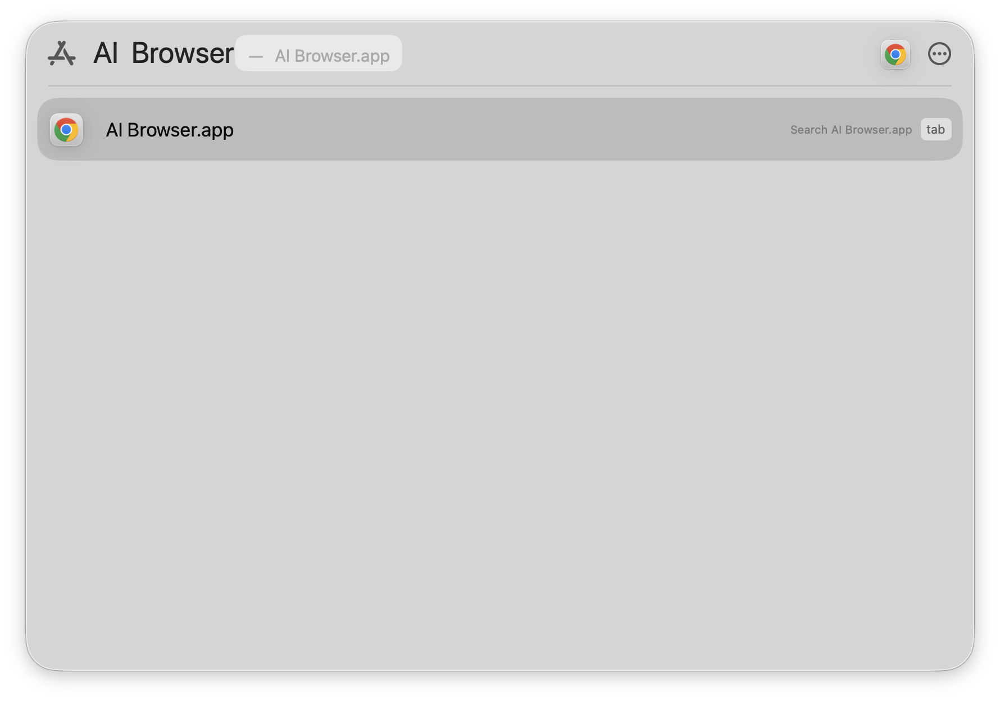

# AI Browser

A dedicated Chrome instance for AI agent testing — persistent profile, remote debugging on port 9224, macOS .app bundle.

---



## Repos in this series

| Repo | What it is |
|------|-----------|
| [ai-test-agent](https://github.com/dosht/ai-test-agent) | The Claude Code agent that drives the browser |
| **ai-browser** (you are here) | This repo — the dedicated Chrome launcher |
| [ai-test-example](https://github.com/dosht/ai-test-example) | Example project showing the full workflow |
| [ai-testing-guide](https://github.com/dosht/ai-testing-guide) | End-to-end guide: setup, patterns, troubleshooting |

---

## What it is and why

When you ask an AI agent to automate a browser, it needs to connect via Chrome DevTools Protocol (CDP). The problem: if you already have Google Chrome open, launching it again with `--remote-debugging-port` silently reuses the existing instance — which ignores the flag. Your main browsing session stays undebuggable.

AI Browser solves this by giving the agent its own Chrome:

- A separate `--user-data-dir` so macOS treats it as a distinct application.
- A dedicated CDP endpoint at `http://127.0.0.1:9224` that is always ready to accept agent connections.
- A persistent profile so cookie jars, logins, and site preferences survive across sessions.
- A `.app` bundle so you can launch it from Spotlight, pin it to the Dock, and keep it out of your main Chrome window.

---

## Install

```bash
curl -fsSL https://raw.githubusercontent.com/dosht/ai-browser/main/install.sh | bash
```

What gets created:

| Path | What |
|------|------|
| `~/.ai-browser/chrome-profile/` | Persistent Chrome profile |
| `~/.local/bin/ai-browser` | CLI launcher |
| `/Applications/AI Browser.app` | macOS app bundle (uses Chrome's icon) |

---

## Usage

Launch AI Browser (pick whichever you prefer):

```bash
ai-browser                   # from the terminal
open -a "AI Browser"         # also from the terminal
# or Spotlight → "AI Browser"
```

If AI Browser is already running the launcher detects it (checks port 9224), brings the window to front, and exits cleanly — so double-launching is safe.

Once the browser is open, point your agent at it:

```bash
# chrome-devtools MCP (used by ai-test-agent)
chrome-devtools start --browserUrl http://127.0.0.1:9224 --headless false
```

---

## How it works

### Why a separate browser?

Chrome uses the `--user-data-dir` to decide whether to open a new process or reuse an existing one. When you run:

```bash
open -n -a "Google Chrome" --args --remote-debugging-port=9224
```

…without a different `--user-data-dir`, macOS hands the request to the already-running Chrome process, which ignores the extra flags. AI Browser always passes `--user-data-dir="$HOME/.ai-browser/chrome-profile"`, which forces a genuinely separate process.

### The shell command permission warning in Claude Code

If you use AI Browser with an agent running inside Claude Code, you may see a permission prompt every time the agent runs a shell command — even something as simple as `curl http://127.0.0.1:9224/json/version`.

This happens because of a known issue with how Claude Code sub-agents inherit MCP server configuration ([GitHub discussion #25200](https://github.com/anthropics/claude-code/discussions/25200)): `mcpServers` defined in the top-level settings are not passed into sub-agents. The sub-agent therefore cannot use the chrome-devtools MCP tool directly and falls back to shell commands, which Claude Code flags for approval.

Until that is resolved upstream the workaround is to approve the commands once per session (or configure `allowedTools` for your agent). The agent itself works correctly either way.

### Know a better way?

If you have a cleaner approach — a way to pass MCP config into sub-agents, a smarter bring-to-front script, or anything else — PRs are very welcome.

---

## Uninstall

```bash
bash uninstall.sh
```

This removes `/Applications/AI Browser.app` and `~/.local/bin/ai-browser`.
Your browsing profile at `~/.ai-browser/` is **not** deleted.
To remove the profile too:

```bash
rm -rf ~/.ai-browser
```

---

## Files

```
install.sh       — one-line installer (run via curl | bash)
uninstall.sh     — removes app + launcher, preserves profile
ai-browser.sh    — the launcher script (embedded verbatim by install.sh)
README.md        — this file
```
